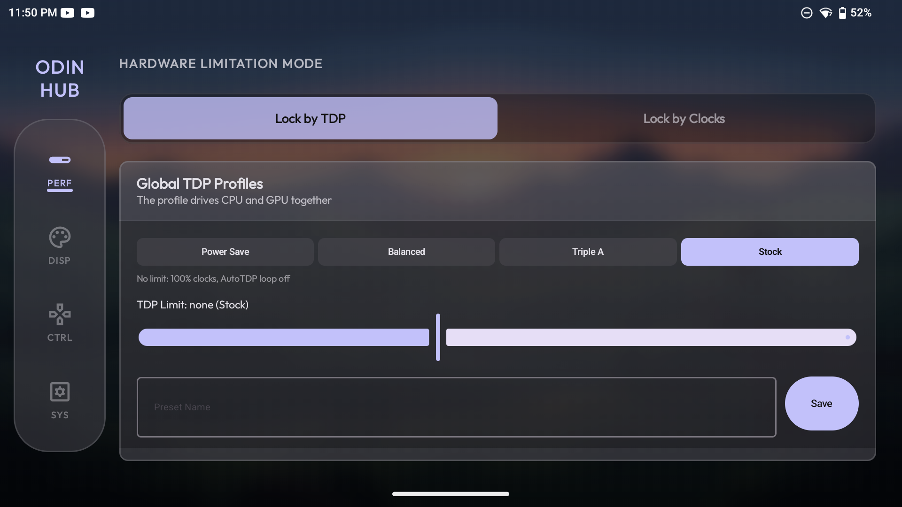
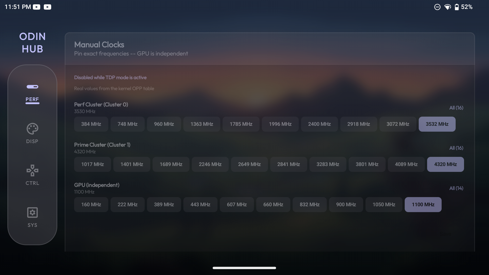
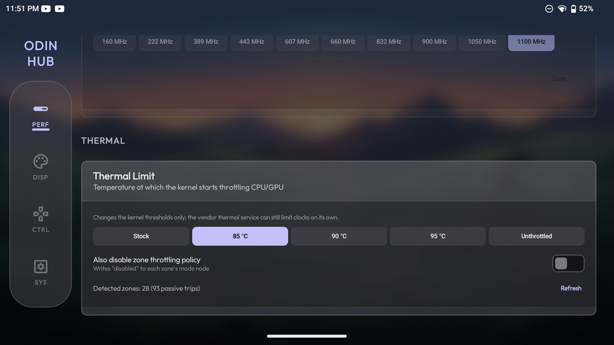
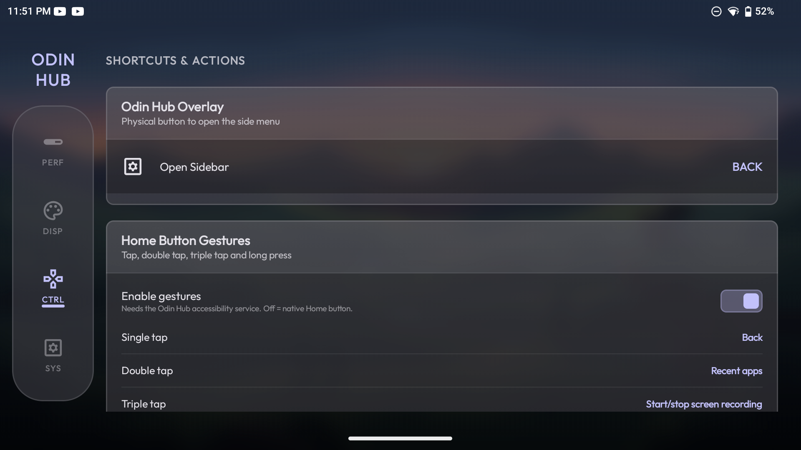
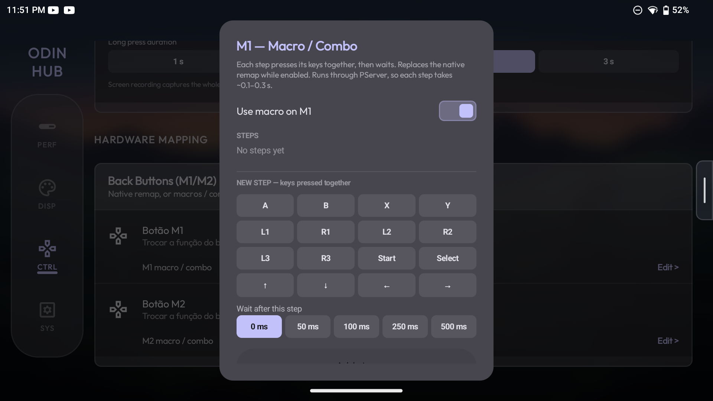
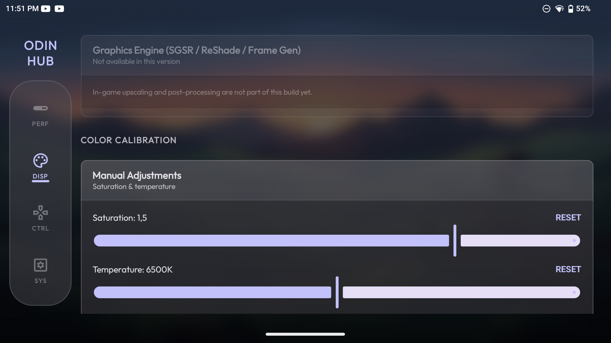
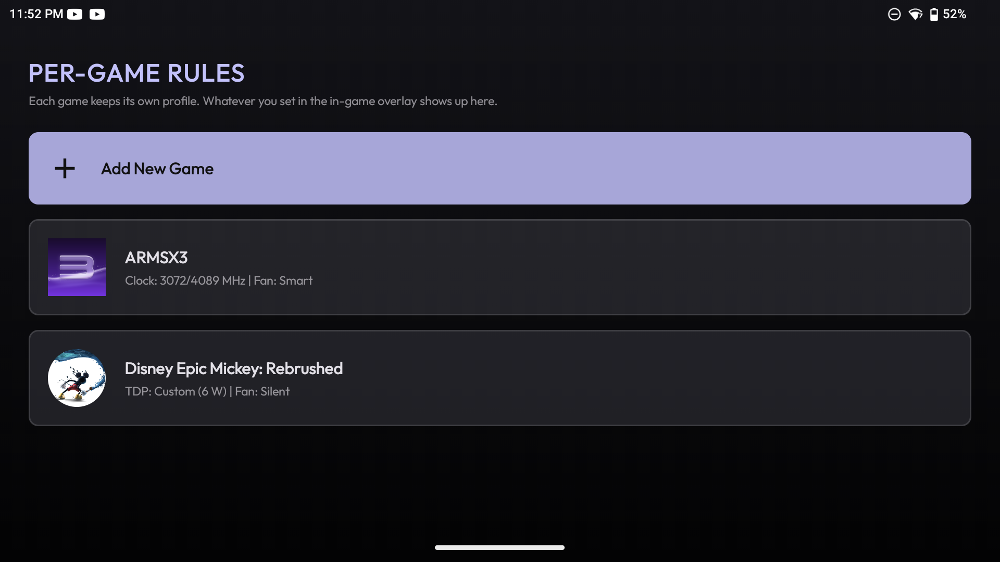

<p align="center">
  
</p>

<h1 align="center">Odin Hub</h1>

<p align="center">
  A console-style hardware and performance control center for the <b>AYN Odin 3</b>.<br>
  Built by <b>dfdevx2</b>.
</p>

<p align="center">
  <a href="https://github.com/dfdevx2/OdinHub/releases/latest"></a>
  
  
</p>

<p align="center">
  
</p>

---

## What this is

The Odin 3 ships with a Snapdragon 8 Elite that is far more powerful than most Android games and emulators need. Left alone, it runs hot, drains the battery fast, and throttles — all to render a PS2 game that would have been happy with a third of that power.

Odin Hub is the layer that sits between you and that silicon. It lets you decide, **per game**, how much of the device to actually spend:

- Cap the CPU/GPU to a target power draw and hold it there.
- Or pin exact clock frequencies per CPU cluster when you want deterministic behaviour.
- Set the fan and display calibration to match.
- Save it all as a rule for that specific game — and have it applied automatically the moment the game opens, and reverted the moment you leave.

The goal is that you configure a game **once** and never think about it again.

## The core idea: per-game profiles

This is the feature everything else exists to serve.

```
You open GTA San Andreas
        │
        ▼
Odin Hub detects the foreground app
        │
        ▼
Looks up that game's rule in its database
        │
        ├── found     → applies 5 W cap, quiet fan, vibrant colors
        └── not found → applies your global profile
        │
        ▼
You leave the game → device returns to the global profile
```

Rules live in a single Room database and are edited from **two places that stay in sync**:

- **Per-App Overrides** screen — configure a game up front, from the couch.
- **In-game overlay** — a side handle you pull out mid-game, like a phone's "game mode" panel. Change the TDP while you play; the rule for that game is created or updated on the spot.

Change a game in one place and the other reflects it. There is no second source of truth.

## Screenshots

| | |
|---|---|
|  |  |
| **Real clock tables** — every chip is a frequency the SoC actually supports | **Thermal limit** — move the throttling point, globally or per game |
|  |  |
| **Home button gestures** — screenshot, full-screen recording, overlay… | **M1 / M2 macros** — combos and timed sequences, global or per game |
|  |  |
| **Color calibration** — saturation and white balance, live | **Per-game rules** — applied when the game opens, reverted when you leave |

## Features

### Performance
- **Dynamic TDP** — a closed loop that reads real-time power draw and walks CPU/GPU clocks down until the device settles at your target wattage (1–25 W), instead of a fixed frequency guess.
- **TDP profiles** — Power Save (11 W), Balanced (12.5 W) and Triple A (15 W), tuned on the Snapdragon 8 Elite, plus Stock (no limit). Profiles are independent from the free slider.
- **Per-cluster clock control** — the real frequencies of each CPU cluster (Perf / Prime) and the Adreno GPU, read live from the kernel's OPP tables (with the real SM8750 / SM8550 tables as fallback). Only one of TDP or manual clocks is active at a time.
- **Thermal limit** — optionally move the first-stage passive trip points of the CPU/GPU thermal zones (85 / 90 / 95 °C or unthrottled), globally or per game. Written through PServerBinder like everything else — no KernelSU/Magisk needed. Emergency trips are never touched, and Stock restores the factory values.
- **Fan control** — Stock, Quiet, Smart and Sport, mapped to the device's real fan modes.
- **Custom profiles** — save your own TDP or clock presets by name.

### Display
- Saturation (0–2×) and color temperature (4000–9000 K, warmer or cooler) applied live through SurfaceFlinger's own color transform.
- Per-game color, from the Per-App Overrides screen or the in-game overlay.

### Controls
- Remap the M1 / M2 rear buttons to any key code — or to a **macro / combo** (several buttons at once, or a timed sequence). Macros can also be set **per game**, from the Per-App Overrides screen or the in-game overlay.
- **Home button gestures** — single, double, triple tap and long press, each mapped to a system action: screenshot, full-screen recording (no app picker, saved to Movies/OdinHub), overlay toggle, recents, notifications, lock screen and more.
- Bind a physical button to open the in-game overlay.

### Interface
- Seven console-inspired themes (Odin OS, Cyberpunk, SNES, NES, PlayStation, Xbox, Steam OS) plus a Light theme, Material You dynamic colors, and an AMOLED black mode.
- D-pad navigable with haptic feedback and focus glow.
- Animated boot sequence, custom wallpapers, and an integrated BGM/SFX mixer.

## How it talks to the hardware

Odin Hub does not run `su` and needs no KernelSU/Magisk. It reaches a privileged helper already present on the device — `PServerBinder`, which runs as root — through `IBinder.transact()`, a technique pioneered by **ClusterTune** and **P.U.L.S.E.** (see Credits). Through that channel it writes to `sysfs` nodes and Android system settings.

Two consequences worth knowing:

1. **Every write is verified.** After writing a frequency, the value is read back from `sysfs` and compared. A write that the kernel silently rejected is reported as a failure rather than assumed to have worked — the UI surfaces it instead of showing a slider that "moved" while nothing happened.
2. **Nodes are written independently.** An earlier design chained every node into one `cmd && cmd && cmd` string, so a single rejected node (a GPU clock locked by the bootloader, say) aborted every write after it. Each node now succeeds or fails on its own.

Foreground-app detection runs through an accessibility service, with a `UsageStatsManager` poll as a fallback so per-game rules and the overlay keep working even if that service is disabled.

## Requirements

- AYN Odin 3.
- The `PServerBinder` helper available on the device (present on stock AYN firmware).
- Permissions granted at first launch: **Usage Access** (foreground-app detection) and **Display over other apps** (the in-game overlay).

## Installing

1. Download the latest APK from the [Releases](https://github.com/dfdevx2/OdinHub/releases/latest) page.
2. Install it on your Odin 3.
3. Launch it and grant the two permissions it asks for.

## Building

```bash
git clone https://github.com/dfdevx2/OdinHub.git
cd OdinHub
./gradlew assembleDebug
```

Requires JDK 17 and the Android SDK (compileSdk 35, minSdk 33). Unit tests:

```bash
./gradlew testDebugUnitTest
```

## Architecture

Some structural decisions here are not obvious from the code, and re-learning them the hard way wastes time. If you are picking this project up, read this first.

### `PerformanceCommandBuilder` — why it exists

Hardware writes are built in one place rather than assembled ad hoc at each call site. It owns:

- **Dynamic cpufreq policy discovery.** Cluster layout varies by SoC and firmware, so policies are scanned at runtime instead of hardcoding `policy0` / `policy6`. The policy with the highest max frequency is treated as Prime.
- **Independent, verified writes.** Each node is one `HardwareWriteOp` that is applied, read back, and retried through a sequential fallback if the chained form failed.
- **A single place for the clamp ratios.** Notably, the floor for dynamic TDP is *lower* than the floor for manual clocks — low targets like 5 W need room to walk the clocks down far enough to actually converge.

`PerformanceManager.lastApplyStatus` exposes the result of the last write pass so the UI can show a real failure instead of trusting a write that never landed.

### `AppOverrideRepository` — the single source of truth

Per-game rules are read and written from very different contexts: a normal ViewModel screen, and a `WindowManager` overlay running outside the activity lifecycle. Both go through this repository, backed by one Room table.

It exposes a `StateFlow<Map<String, AppOverrideEntity>>` kept warm by a Room `Flow`, so the accessibility thread can read the current rule synchronously via `.value` without ever touching disk on that thread. **If you add a new per-game setting, it goes on `AppOverrideEntity`** — not into a new `SharedPreferences` key.

### `ForegroundAppTracker` — reactive, in-memory only

Which app is in the foreground is *momentary* information, so it lives in a `StateFlow` and is never persisted. The overlay observes it, which is what lets its Compose tree re-key per game — the overlay is created once and would otherwise stay frozen on whatever game was open when the service started.

### Threading rule

Every root call is blocking. Anything triggered by user interaction — a slider drag, a toggle, an app switch — must be dispatched to `Dispatchers.IO`, and continuous controls should debounce with a cancellable job. A blocking root call on the main thread is enough to freeze the app during startup or make a slider unusable.

## Credits

Odin Hub is a heavily reworked derivative of existing open-source work, and stands on it:

- **[OdinTools](https://github.com/langerhans/OdinTools)** by Maximilian Keller (langerhans) — the original foundation this project was forked from: app-override plumbing and quick-settings infrastructure.
- **[P.U.L.S.E.](https://github.com/keiretrogaming/pulse)** by keiretrogaming — the `PServerBinder` technique and the closed-loop AutoTDP concept that make deep hardware control possible without a traditional root setup.
- **[ClusterTune](https://github.com/AurelioB/ClusterTune)** by AurelioB — the original pioneer of the PServer sysfs approach.

## License

MIT. The original copyright notice is retained in [`LICENSE`](./LICENSE) as the license requires, alongside the copyright for this project's own work.
